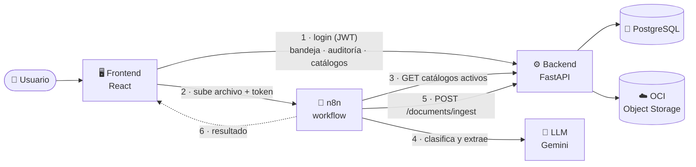

# MediFlow — Agente Autónomo para Triaje, Extracción y Enrutamiento de Documentos Clínicos

> **Hackathon ONE G10** | *Oracle Next Education & Alura*
> **Sector:** HealthTech / Gestión Hospitalaria / Aseguradoras de Salud

---

## 📋 ¿Qué es MediFlow?

En hospitales y aseguradoras, cada día llegan cientos de documentos (informes de laboratorio, recetas, epicrisis, informes de imágenes) que hoy se leen y derivan **a mano**. Es lento y propenso a errores.

**MediFlow** automatiza ese proceso con Inteligencia Artificial:

1. **Recibe** el documento (PDF o imagen).
2. **Lo clasifica y extrae** los datos clave (paciente, médico, diagnóstico CIE-10, prioridad).
3. **Decide a qué cola enviarlo** (por ejemplo, Urgencias, Farmacia Hospitalaria o Ficha Clínica). Los tipos de documento y las colas posibles **no están fijos en el código**: son tablas maestras que un administrador gestiona desde la API.
4. Si la IA **no está segura** (confianza baja) o el caso lo requiere, lo deja en una **bandeja de auditoría** para que una persona lo revise y corrija (*Human-in-the-Loop*).
5. **Guarda** los archivos originales y el resultado estructurado en **Oracle Cloud (OCI Object Storage)**, y los registra en **PostgreSQL**.

## 🎯 Objetivos

1. **Ingestión multimodal:** PDFs escaneados o digitales, imágenes y JSON.
2. **Clasificación y extracción precisa** con LLMs multimodales.
3. **Orquestación con agentes** que evalúan confianza y severidad.
4. **Human-in-the-Loop:** los casos dudosos van a una cola de auditoría manual.
5. **Persistencia en la nube** usando solo la capa *Always Free* de OCI.

---

## 🧩 Arquitectura general



1. El usuario inicia sesión en el front, que obtiene un JWT del backend.
2. El front sube el documento al **webhook de n8n** junto con su token.
3. n8n consulta los **catálogos activos** (tipos de documento y colas) al backend.
4. El LLM clasifica el documento y extrae los datos, eligiendo **solo** entre las opciones del catálogo.
5. n8n envía el resultado a `POST /documents/ingest`. El backend aplica el triaje, guarda los archivos y el JSON en **OCI** y registra todo en **PostgreSQL**.
6. n8n devuelve al front la respuesta del backend.

**Regla de triaje:** el backend deja un documento en `PENDIENTE_AUDITORIA` si se cumple **cualquiera** de estas condiciones; si no se cumple ninguna, queda `PROCESADO`:

- score de confianza **menor a 0.85**;
- el workflow marca `requiere_auditoria_humana`;
- el tipo es `OTRO` (no clasificable);
- el tipo o la cola no existen (o están inactivos) en las tablas maestras;
- `detalle_clinico` trae un bloque que no corresponde al tipo;
- `campos_adicionales` no cumple el JSON Schema definido para el tipo en el catálogo.

Los motivos se devuelven en `motivos_auditoria` y quedan guardados junto al documento.

| Estado | Significado | Ruta del JSON en OCI |
|---|---|---|
| `PROCESADO` | Enrutado automáticamente | `procesados/<prioridad>/<id>.json` |
| `PENDIENTE_AUDITORIA` | Espera revisión humana | `auditoria_humana/<id>.json` |
| `AUDITADO` | Corregido por un auditor | `procesados/auditados/<id>.json` |
| `DESCARTADO` | Descartado por un auditor (no clínico, duplicado, ilegible) | `descartados/<id>.json` |

Los archivos originales se guardan en `recibidos/<id>/<n>.<extensión>` (un documento puede traer varios archivos; `n` es su posición: `0`, `1`, ...).

---

## 📁 Estructura del repositorio

```
.
├── backend/                 # API REST en FastAPI (detalle en backend/README.md)
├── frontend/                # Interfaz web en React + Vite (detalle en frontend/README.md)
├── workflow/                # Workflow de n8n (MediFlow_unificado.json) y su README
├── docker/
│   └── postgres/            # init.sql (tablas, índices, maestras) + seed_dev_users.sql (solo dev)
├── deploy/                  # Caddyfile + imagen del front (producción)
├── docker-compose.yml       # Desarrollo: PostgreSQL 16 + n8n
├── docker-compose.prod.yml  # Producción en OCI: Caddy + front + backend + n8n + PostgreSQL
├── .env.example             # Credenciales del contenedor de PostgreSQL (desarrollo)
├── .env.prod.example        # Todas las variables de producción
└── README.md                # Este archivo
```

> Hay **dos archivos `.env` distintos**:
> - `.env` en la **raíz**: solo usuario, contraseña y nombre de la base que crea Docker.
> - `backend/.env`: configuración de la API (conexión a la base, JWT, OCI).
>
> El usuario, la contraseña y el nombre de la base deben ser **iguales en ambos**.

---

## 🚀 Puesta en marcha (paso a paso)

### Requisitos

| Herramienta | Para qué | Cómo comprobarlo |
|---|---|---|
| [Docker Desktop](https://www.docker.com/products/docker-desktop/) (o Docker Engine + Compose) | Levantar PostgreSQL | `docker compose version` |
| Python **3.11 o superior** | Ejecutar el backend | `py -0p` (Windows) o `python3 --version` (Linux/macOS) |
| Credenciales de OCI *(opcional al inicio)* | Guardar documentos en Oracle Cloud | Ver [`backend/README.md`](backend/README.md#4-configurar-oci-opcional-para-empezar) |

> Sin OCI la API **arranca igual**: funcionan el login, los usuarios y las tablas maestras. Solo fallan la ingesta de documentos y la vista previa de auditoría, y `/health` responde `503`.

Todos los comandos se ejecutan desde la **raíz del repositorio**, salvo que se indique otra carpeta.

### Paso 1 — Levantar la base de datos (Docker)

1. Crear el `.env` de la raíz a partir del ejemplo:

   ```bash
   cp .env.example .env          # Linux / macOS / Git Bash
   ```
   ```powershell
   Copy-Item .env.example .env   # Windows PowerShell
   ```

   Los valores del ejemplo sirven tal cual para desarrollo local.

2. Levantar PostgreSQL:

   ```bash
   docker compose up -d
   ```

3. Esperar a que esté listo (la columna `STATUS` debe decir `healthy`):

   ```bash
   docker compose ps
   ```

**¿Qué pasa la primera vez?** Docker crea el volumen `postgres_data` y ejecuta automáticamente `docker/postgres/init.sql`, que:

- crea todas las tablas e índices (usuarios, documentos clínicos y sus tablas hijas, tokens revocados, tablas maestras);
- crea **un usuario de prueba por rol** (ver [Usuarios de prueba](#usuarios-de-prueba));
- carga las **tablas maestras semilla**: 10 tipos de documento y 6 colas de enrutamiento.

> ⚠️ `init.sql` se ejecuta **solo cuando el volumen está vacío** (primera vez). Si ya tenías la base creada de antes, no se vuelve a ejecutar solo: ver [Actualizar una base existente](#actualizar-una-base-existente).

### Paso 2 — Levantar el backend

Resumen (el detalle y la explicación de cada variable están en [`backend/README.md`](backend/README.md)):

```powershell
# Windows PowerShell
cd backend
py -3.12 -m venv .venv
.venv\Scripts\Activate.ps1
pip install -r requirements-dev.txt
Copy-Item .env.example .env
uvicorn app.main:app --reload --port 8000
```

```bash
# Linux / macOS
cd backend
python3 -m venv .venv
source .venv/bin/activate
pip install -r requirements-dev.txt
cp .env.example .env
uvicorn app.main:app --reload --port 8000
```

Si no cambiaste las credenciales del `.env` de la raíz, el `backend/.env` de ejemplo ya apunta a la base correcta.

### Paso 3 — Comprobar que todo funciona

1. Abrir la documentación interactiva: <http://localhost:8000/docs>
2. Iniciar sesión con el usuario de prueba:

   ```bash
   curl -X POST http://localhost:8000/api/v1/auth/login \
        -H "Content-Type: application/json" \
        -d '{"username": "admin_user", "password": "admin123"}'
   ```

   Debe devolver un `access_token`. En Swagger (`/docs`) puedes usar el botón **Authorize** con ese mismo usuario.

3. Consultar las colas cargadas por la semilla (reemplaza `<TOKEN>`):

   ```bash
   curl http://localhost:8000/api/v1/catalogs/queues/active -H "Authorization: Bearer <TOKEN>"
   ```

4. Estado general: `curl http://localhost:8000/api/v1/health` → `200` si la base y OCI responden, `503` si alguno falla (sin OCI configurado es normal ver `503`).

### Usuarios de prueba

`docker/postgres/seed_dev_users.sql` crea un usuario por rol (solo en desarrollo: `docker-compose.prod.yml` no lo carga):

| Usuario | Contraseña | Rol |
|---|---|---|
| `admin_user` | `admin123` | `ADMIN` |
| `gestor_user` | `gestor123` | `GESTOR_USUARIOS` |
| `auditor_user` | `auditor123` | `AUDITOR_CLINICO` |
| `operador_user` | `operador123` | `OPERADOR` |

> ⚠️ Son solo para desarrollo. Desactívalos o cambia sus contraseñas, y cambia el `JWT_SECRET_KEY`, antes de cualquier despliegue real.

### Actualizar una base existente

Si tu base se creó con una versión anterior de `init.sql` (por ejemplo, antes de existir las tablas maestras), tienes dos opciones:

**Opción A — conservar los datos (recomendada).** `init.sql` se puede ejecutar varias veces sin problema: solo crea lo que falta y no duplica registros.

Con el contenedor levantado (`docker compose up -d`), ejecuta el script que ya está montado dentro del contenedor (usa el usuario y la base de tu `.env` de la raíz):

```bash
docker compose exec postgres psql -U mediflow_admin -d mediflow_db -f /docker-entrypoint-initdb.d/init.sql
docker compose exec postgres psql -U mediflow_admin -d mediflow_db -f /docker-entrypoint-initdb.d/seed_dev_users.sql
```

Funciona igual en PowerShell, Linux y macOS. En **Git Bash** antepón `MSYS_NO_PATHCONV=1 ` al comando para que no modifique la ruta. Los mensajes `NOTICE: ... already exists, skipping` son normales.

**Opción B — empezar de cero.** ⚠️ **Borra todos los datos** (usuarios, documentos, etc.):

```bash
docker compose down -v
docker compose up -d
```

### Comandos útiles de la base de datos

```bash
docker compose ps                  # ver estado
docker compose logs -f postgres    # ver logs
docker compose stop                # detener (conserva los datos)
docker compose down                # detener y eliminar el contenedor (conserva los datos)
docker compose down -v             # detener y BORRAR los datos
docker compose exec postgres psql -U mediflow_admin -d mediflow_db   # consola SQL
```

Para conectarte con un cliente gráfico (DBeaver, TablePlus, pgAdmin): host `localhost`, puerto `5432`, y usuario/contraseña/base del `.env` de la raíz.

---

## 👥 Roles de usuario

| Rol | Puede hacer |
|---|---|
| `ADMIN` | Todo: gestionar usuarios, ver documentos, ingestar, auditar y **administrar las tablas maestras** |
| `GESTOR_USUARIOS` | Crear, listar y modificar usuarios |
| `AUDITOR_CLINICO` | Subir documentos, ver la bandeja completa y tomar, resolver o descartar casos de auditoría |
| `OPERADOR` | Subir documentos (admisión/recepción) y ver **solo los que subió** |

Todos los usuarios autenticados pueden ver y editar su propio perfil, cambiar su contraseña y **consultar** las tablas maestras.

---

## 🗂️ Tablas maestras (catálogos)

Definen las opciones que el workflow de IA puede elegir. n8n las lee desde la API antes de llamar al LLM, así que agregar o desactivar una opción **no requiere tocar el workflow**.

| Maestra | Registros semilla |
|---|---|
| **Tipos de documento** | Receta Médica · Informe de Laboratorio · Informe de Estudio por Imágenes · Solicitud de Procedimiento · Epicrisis / Informe de Alta · Interconsulta / Derivación · Informe de Anatomía Patológica · Protocolo Operatorio · Nota de Atención Ambulatoria · Otro / No clasificable |
| **Colas de enrutamiento** | Urgencias · Farmacia Hospitalaria · Procedimientos y Quirófano · Interconsultas y Derivaciones · Oncología · Ficha Clínica (destino por defecto) |

Cada registro trae una descripción que el LLM usa para decidir; los tipos pueden definir además campos propios a extraer (`campos_extraccion`, un JSON Schema). Cada cambio queda en un historial, y `OTRO` y `Ficha_Clinica` están protegidos porque el sistema depende de ellos. Al **eliminar**, el backend aplica *Smart Delete*: si ningún documento clínico usa el registro lo borra físicamente; si alguno lo usa, solo lo desactiva para no dejar documentos huérfanos. Detalle en [`backend/README.md`](backend/README.md#tablas-maestras-catálogos).

---

## 🔌 Resumen de la API

Prefijo: `/api/v1`. Salvo `health` y `login`, todos requieren `Authorization: Bearer <token>`. El detalle está en [`backend/README.md`](backend/README.md).

| Área | Endpoints |
|---|---|
| Salud | `GET /health` |
| Autenticación | `POST /auth/login`, `POST /auth/logout`, `GET /auth/me` |
| Perfil y usuarios | `/users/me`, `/users/me/change-password`, `/users` |
| Documentos | `POST /documents/ingest`, `GET /documents` |
| Auditoría | `GET /audit/{documento_id}`, `POST`/`DELETE /audit/{documento_id}/claim`, `PUT /audit/{documento_id}/resolve`, `PUT /audit/{documento_id}/discard` |
| Tablas maestras | CRUD en `/catalogs/queues` y `/catalogs/document-types`, más `/active` (para n8n) y `/{id}/history` en cada una |

---

## 📚 Documentación

| Documento | Para quién |
|---|---|
| [`backend/README.md`](backend/README.md) | Backend: instalación, endpoints, reglas, base de datos y pruebas |
| [`frontend/README.md`](frontend/README.md) | Frontend: stack, scripts y qué endpoints usa cada pantalla |
| [`workflow/README.md`](workflow/README.md) | Workflow de n8n: flujo, configuración y reglas de uso de tokens |
| [`docs/DESPLIEGUE_OCI.md`](docs/DESPLIEGUE_OCI.md) | Despliegue en Oracle Cloud y checklist de seguridad |
| Swagger (`/docs` con la API levantada, solo fuera de producción) | Probar los endpoints y ver los esquemas exactos |

---

## 🛠️ Tecnologías

FastAPI · Python 3.11+ · PostgreSQL 16 · SQLAlchemy 2.0 (async) · Pydantic v2 · JWT · Oracle Cloud Infrastructure (Object Storage) · Docker Compose · n8n (workflow de IA) · React 19 + Vite + Tailwind CSS (frontend)
